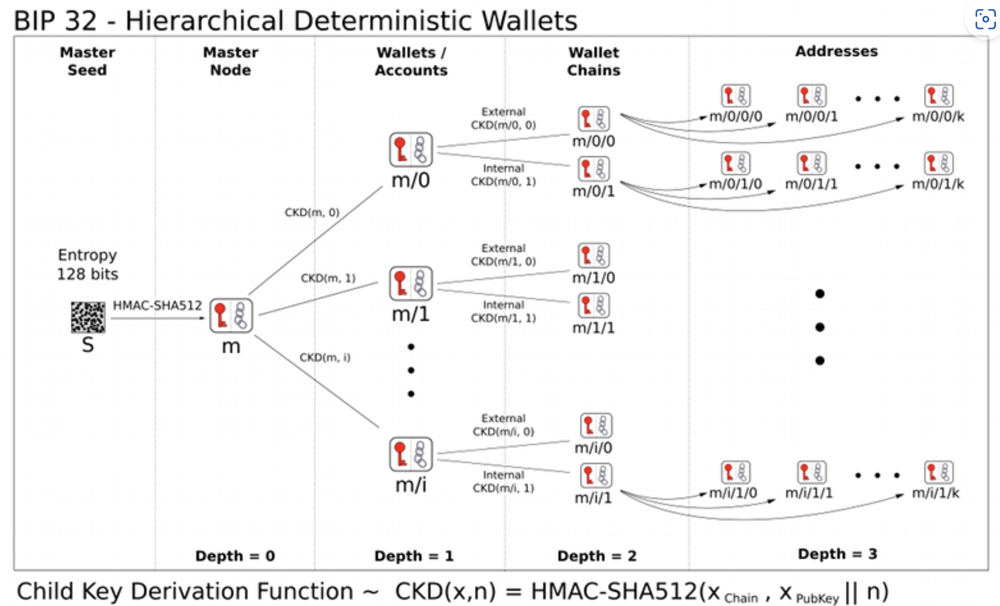
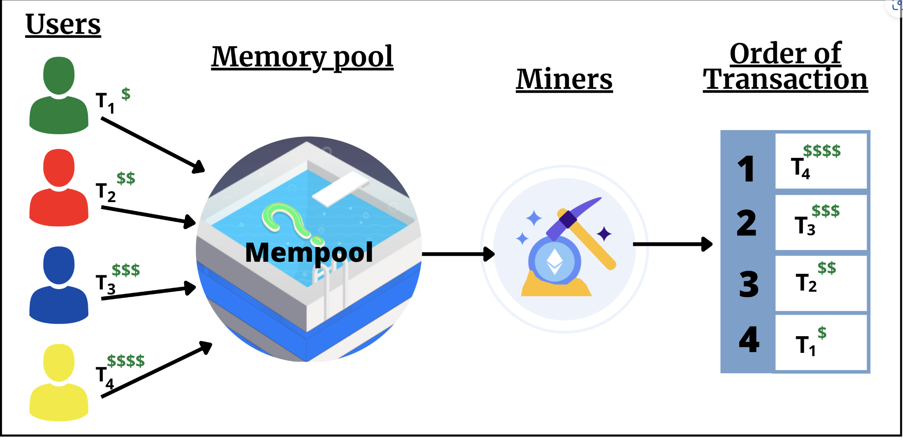

## ether.js 基础
### 1. Provider
provider 类是对以太坊网络连接的抽象，为标准以太坊节点功能提供简洁、一致的接口。在ethers中，Provider不接触用户私钥，只能读取链上信息，不能写入，这一点比web3.js要安全。
除了默认提供者defaultProvider以外，ethers中最常用的是**jsonRpcProvider**，可以让用户连接到特定节点服务商的节点。

### 2. Contract合约类[Contract合约类](./src/ReadContract.js)
在ethers中，Contract类是部署在以太坊网络上的合约（EVM字节码）的抽象。通过它，开发者可以非常容易的对合约进行读取call和交易transcation，并可以获得交易的结果和事件。以太坊强大的地方正是合约，所以对于合约的操作要熟练掌握.
两种：
- 只读合约
  只读Contract只能读取链上合约信息，执行call操作，即调用合约中view和pure的函数，而不能执行交易transaction。
  ``` solidity 
  const contract = new ethers.Contract(`address`, `abi`, `provider`);
  ```
- 读写合约
  可读写Contract：参数分别是合约地址，合约abi和signer变量。Signer签名者是ethers中的另一个类，用于签名交易.
  ``` solidity
  const contract = new ethers.Contract(`address`, `abi`, `signer`);
  ```
### 3. Signer签名者类 [Signer签名者类](./src/SendETH.js)
在ethers.js中，Provider提供器类管理网络连接状态，Signer签名者类或Wallet钱包类管理密钥，安全且灵活.
在ethers中，Signer签名者类是以太坊账户的抽象，可用于对消息和交易进行签名，并将签名的交易发送到以太坊网络，并且更改区块链状态。Signer类是抽象类，不能直接实例化，我们需要使用它的子类：Wallet钱包类。

##### 3.1  Wallet钱包类
Wallet类继承了Signer类，并且开发者可以像包含私钥的外部拥有帐户（EOA）一样，用它对交易和消息进行签名。
创建Wallet对象有三种方法：
- ethers.Wallet.createRandom()
- 用私钥创建wallet对象
- 从助记词创建wallet对象
- 其他方法：通过JSON文件创建wallet对象
### 4. 写合约[写合约](./src/WriteContract.js)
### 5. 部署合约[部署合约](./src/DeployContract.js)
在以太坊上，智能合约的部署是一种特殊的交易：将编译智能合约得到的字节码发送到0地址。如果这个合约的构造函数有参数的话，需要利用abi.encode将参数编码为字节码，然后附在在合约字节码的尾部一起发送.

### 6. 检索事件[检索事件](./src/Event.js)
智能合约释放的事件存储于以太坊虚拟机中的日志中。日志分为两个主题：topics和数据data部分，其中事件哈希和indexed变量存储于topics中，作为检索方便以后搜索，没有indexed变量存储于data中，不能被直接检索，但可以存储更复杂的数据结构.

### 7. 监听合约事件[监听合约事件](./src/ContractListener.js)
- contract.on : 持续监听合约事件
- contract.once: 只监听一次合约释放事件
  
### 8. 事件过滤[EventFilter](./src/EventFilter.js)
在监听过程中增加过滤，监听制定地址的转入转出。
- 过滤器
  - 当合约创建日志（释放事件）时，它最多可以包含4条数据作为索引（indexed）.索引数据经过哈希处理并包含在布隆过滤器中，这是一种允许有效过滤的数据结构。因此，一个事件过滤器最多包含4个主题集，每个主题集是个条件，用于筛选目标事件.
  - 规则
    - 如果一个主题集为null，则该位置的日志主题不会被过滤，任何值都匹配
    - 如果主题集是单个值，则该位置的日志主题必须与该值匹配
    - 如果主题集是数组，则该位置的日志主题至少与数组中其中一个匹配
  - 构建过滤器
    - ethers.js中的合约类提供了contract.filters来简化过滤器的创建
    ``` 
      const filter = contract.filters.EVENT_NAME( ...args ) 
    ```
    其中EVENT_NAME是要过滤的事件名,...args为主题集\条件<br/>
    1. 过滤来自myAddress地址的Transfer事件
     ```
     contract.filters.Transfer(myAddress)
     ```
    2. 过滤所有发给 myAddress地址的Transfer事件 
    ```
     contract.filters.Transfer(null, myAddress)
     ```
    3. 过滤所有从 myAddress发给otherAddress的Transfer事件
    ```
     contract.filters.Transfer(myAddress, otherAddress)
     ```
    4. 过滤所有发给myAddress或otherAddress的Transfer事件
    ```
     contract.filters.Transfer(null, [ myAddress, otherAddress ])
     ```
### 9. 静态调用[静态调用](./src/StaticCall.js)
staticCall方法是在发送交易之前，检查交易是否会失败，节省大量gas.
ethers.js将eth_call封装在staticCall方法中，方便开发者模拟交易的结果，并避免发送可能失败的交易。我们利用staticCall模拟了Vitalik和测试钱包的转账。当然，这个方法还有更多用处，比如计算土狗币的交易滑点.

### 10. 识别ERC721合约[识别ERC721合约](./src/ERC721Interface.js)
ERC721合约中会实现IERC165接口合约的supportsInterface函数，并且当查询0x80ac58cd（ERC721接口id）时返回true
介绍如何ethers.js来识别一个合约是否为ERC721。由于利用了ERC165标准，因此只有支持ERC165标准的合约才能用这个方法识别，包括ERC721，ERC1155等。但是像ERC20这种不支持ERC165的标准，就要用别的方法识别了.

### 11. 编码calldata[编码calldata](./src/Calldata.js)
ethers.js的接口类抽象了与以太坊网络上的合约交互所需的ABI编码和解码.接口类封装了一些编码解码的方法。与一些特殊的合约交互时（比如代理合约），你需要编码参数、解码返回值.
### 12. 批量生成钱包[批量生成钱包](./src/HDwallet.js)
HD钱包（Hierarchical Deterministic Wallet，多层确定性钱包）是一种数字钱包 ，通常用于存储比特币和以太坊等加密货币持有者的数字密钥。通过它，用户可以从一个随机种子创建一系列密钥对，更加便利、安全、隐私.
BIP协议：
- BIP32
  - 在BIP32推出之前，用户需要记录一堆的私钥才能管理很多钱包。BIP32提出可以用一个随机种子衍生多个私钥，更方便的管理多个钱包
  
- BIP44
  - IP44为BIP32的衍生路径提供了一套通用规范，适配比特币、以太坊等多链。这一套规范包含六级，每级之间用"/"分割：
  ```
    m / purpose' / coin_type' / account' / change / address_index
  ```  
    - m: 固定为"m"
    - purpose：固定为"44"
    - coin_type：代币类型，比特币主网为0，比特币测试网为1，以太坊主网为60
    - account：账户索引，从0开始
    - change：是否为外部链，0为外部链，1为内部链，一般填0
    - address_index：地址索引，从0开始，想生成新地址就把这里改为1，2，3
- BIP39
  - BIP39让用户能以一些人类可记忆的助记词的方式保管私钥，而不是一串16进制的数字：
  ``` javascript
    私钥
    0x813f8f0a4df26f6455814fdd07dd2ab2d0e2d13f4d2f3c66e7fd9e3856060f89
    助记词
    air organ twist rule prison symptom jazz cheap rather dizzy verb glare jeans orbit weapon universe require tired sing casino business anxiety seminar hunt
  ```
### 13. 批量转账[批量转账](./src/MultiTransfer.js)
- 部署空投合约(sepolla) 
  - ERC20合约地址：0x836759c18deAF143A240f985609317eD7Ff05B5D
  - 空头合约地址: 0x34A4B863d510B2710f5BCb66A495AD8f2ff8099F
  - WETH 合约地址： 0xf531b8f309be94191af87605cfbf600d71c2cfe0(不确定)
### 14. 批量归集[批量归集](./src/MulitiCollect.js)
```
  for (let i = 0; i < numWallet; i++) {
        // 将钱包连接到provider
        let walletiWithProvider = wallets[i].connect(provider)
        // 将合约连接到新的钱包
        let contractConnected = contractWTF.connect(walletiWithProvider)
        var tx = await contractConnected.transfer(wallet.address, amount)
        console.log(`第 ${i+1} 个钱包 ${wallets[i].address} WTF 归集开始`)
    }
    await tx.wait()
    console.log(`WTF 归集结束`)
```
批量归集的核心是在循环中通过HD派生的钱包转账到目标钱包。
### 15. 监听Mempool[监听Mempool](./src/Mempool.js)
MEV(Maximal Extractable Value，最大可提取价值)，在区块链中，矿工通过打包，排除或者重新排序他们产出的区块中的交易来获得一定的利润，而MEV是衡量这种利润的指标。
- Mempool
  在用户的交易被矿工打包进以太坊区块链之前，所有交易会汇集到Mempool（交易内存池）中。矿工也是在这里寻找费用高的交易优先打包，实现利益最大化。通常来说，gas price越高的交易，越容易被打包。<br/>
  同时，一些MEV机器人也会搜索mempool中有利可图的交易。比如，一笔滑点设置过高的swap交易可能会被三明治攻击：通过调整gas，机器人会在这笔交易之前插一个买单，之后发送一个卖单，等效于把把代币以高价卖给用户（抢跑）。
  
- 监听
  利用ethers.js的Provider类提供的方法，监听mempool中的pending（未决，待打包）交易：
  ```
    provider.on("pending", listener)
  ```  
### 16. 解码交易详情[解码交易详情](./src/DecodeTx.js)
- 未决交易
  未决交易是用户发出但没被矿工打包上链的交易，在mempool（交易内存池）中出现.
- interface 
  ethers.js提供了Interface类方便解码交易数据。声明Interface类型和声明abi的方法差不多
  ```
    const iface = ethers.Interface([
      "function balanceOf(address) public view returns(uint)",
      "function transfer(address, uint) public returns (bool)",
      "function approve(address, uint256) public returns (bool)"
    ]);
  ```  
### 17. 抢先交易脚本[抢先交易脚本](./src/Frontrun.js)

```
Available Accounts
==================

(0) "0xf39Fd6e51aad88F6F4ce6aB8827279cffFb92266" (10000.000000000000000000 ETH)
(1) "0x70997970C51812dc3A010C7d01b50e0d17dc79C8" (10000.000000000000000000 ETH)
(2) "0x3C44CdDdB6a900fa2b585dd299e03d12FA4293BC" (10000.000000000000000000 ETH)
(3) "0x90F79bf6EB2c4f870365E785982E1f101E93b906" (10000.000000000000000000 ETH)
(4) "0x15d34AAf54267DB7D7c367839AAf71A00a2C6A65" (10000.000000000000000000 ETH)
(5) "0x9965507D1a55bcC2695C58ba16FB37d819B0A4dc" (10000.000000000000000000 ETH)
(6) "0x976EA74026E726554dB657fA54763abd0C3a0aa9" (10000.000000000000000000 ETH)
(7) "0x14dC79964da2C08b23698B3D3cc7Ca32193d9955" (10000.000000000000000000 ETH)
(8) "0x23618e81E3f5cdF7f54C3d65f7FBc0aBf5B21E8f" (10000.000000000000000000 ETH)
(9) "0xa0Ee7A142d267C1f36714E4a8F75612F20a79720" (10000.000000000000000000 ETH)

Private Keys
==================

(0) 0xac0974bec39a17e36ba4a6b4d238ff944bacb478cbed5efcae784d7bf4f2ff80
(1) 0x59c6995e998f97a5a0044966f0945389dc9e86dae88c7a8412f4603b6b78690d
(2) 0x5de4111afa1a4b94908f83103eb1f1706367c2e68ca870fc3fb9a804cdab365a
(3) 0x7c852118294e51e653712a81e05800f419141751be58f605c371e15141b007a6
(4) 0x47e179ec197488593b187f80a00eb0da91f1b9d0b13f8733639f19c30a34926a
(5) 0x8b3a350cf5c34c9194ca85829a2df0ec3153be0318b5e2d3348e872092edffba
(6) 0x92db14e403b83dfe3df233f83dfa3a0d7096f21ca9b0d6d6b8d88b2b4ec1564e
(7) 0x4bbbf85ce3377467afe5d46f804f221813b2bb87f24d81f60f1fcdbf7cbf4356
(8) 0xdbda1821b80551c9d65939329250298aa3472ba22feea921c0cf5d620ea67b97
(9) 0x2a871d0798f97d79848a013d4936a73bf4cc922c825d33c1cf7073dff6d409c6
```
- 预防方法:
  抢先交易是以太坊等公链上普遍存在的问题。我们没法消除它，但是可以通过减少交易顺序或时间的重要性，减少被抢先交易的收益：  
  - 使用预提交方案(commit-reveal scheme)。
  - 使用暗池，用户发出的交易将不进入公开的mempool，而是直接到矿工手里。例如 flashbots 和 TaiChi.


  
